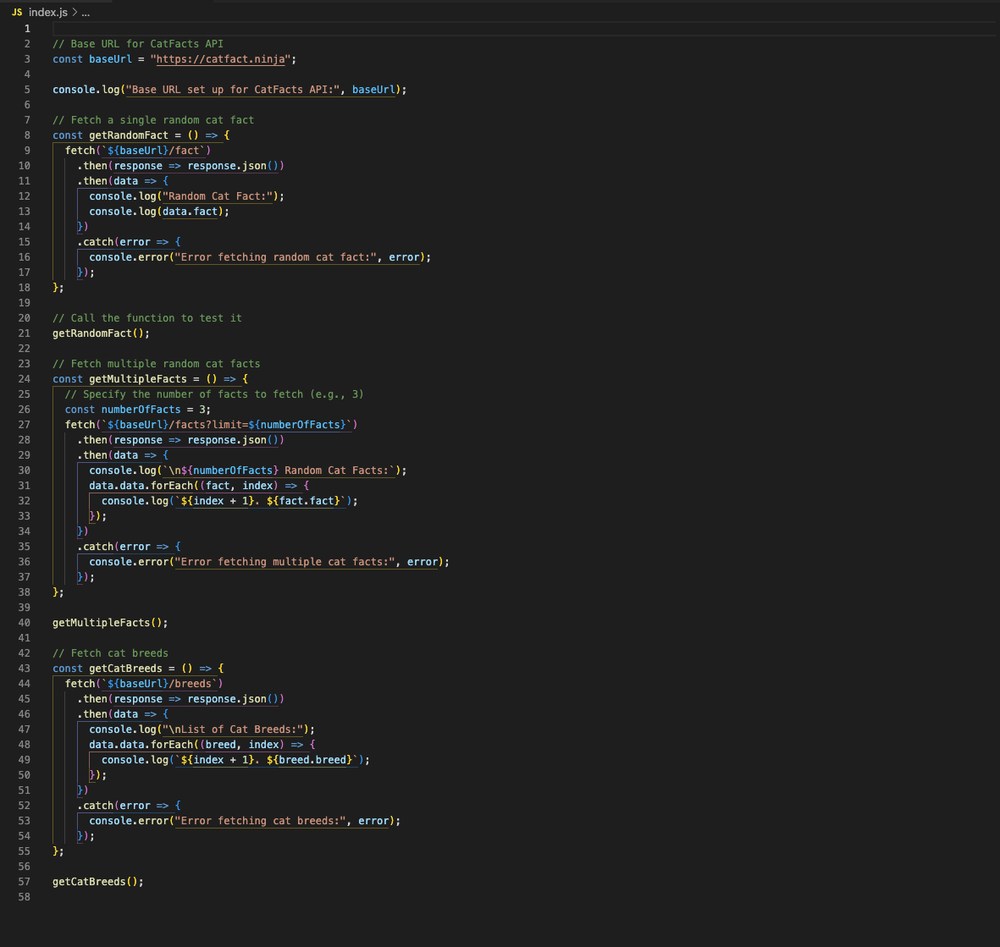

# Fetch with Promises: Working with APIs in JavaScript



---

## Description 📄

JavaScript's **fetch API** combined with **promises** allows developers to handle **asynchronous operations** like retrieving data from external sources, such as APIs. This non-blocking approach ensures that JavaScript can perform other tasks while waiting for the data to be fetched, leading to more efficient and responsive applications.

In this lab, you'll learn how to use **fetch** and promises to:
- **Retrieve data** from a web API using HTTP requests.
- **Handle responses** by parsing JSON and handling success or failure scenarios.
- **Display results** from fetched data in the console.
- Chain promises to **manage sequential API requests** effectively.

The lab demonstrates how to use **fetch** to interact with the **CatFacts API**, covering how to request a single cat fact, multiple cat facts, and a list of cat breeds. Understanding how to fetch data and handle promises is essential for creating dynamic, data-driven applications in JavaScript.

To learn more about the available endpoints and settings, visit the [CatFacts API website](https://catfact.ninja/). This site provides details on how to use various endpoints, such as fetching a single random cat fact, retrieving multiple facts, and listing cat breeds.

## Expected Project Structure 🏗️
Your project should be structured as follows:

```plaintext
fetch-promises-lab/
├── index.js
└── README.md
```

##

## Instructions ✅

### 1. **Create the Project Folder and Files**
   - [ ] Create a project folder named `promises-with-fetch` to store your project files.

   - [ ] Inside the `promises-with-fetch` folder, create a file named `index.js`. This will be your main JavaScript file where all your code will be written.

##

### 2. **Setting Up the Base URL for Fetch Requests**

In this step, you will set up a **base URL** to streamline making requests to the **CatFacts API**. This will allow you to easily access different endpoints of the API without repeating the base URL in each fetch request. Setting up a base URL simplifies your code and makes it easier to manage and update if the URL changes.


- [ ] Add the following code to your `index.js` file:

```javascript
// Base URL for CatFacts API
const baseUrl = "https://catfact.ninja";

console.log("Base URL set up for CatFacts API:", baseUrl);
```

 [ ] Run your code using Node.js in the terminal:

```bash
node index.js
```

### Expected Output:

```bash
Base URL set up for CatFacts API: https://catfact.ninja
```

**Explanation:**

- **Setting the Base URL:** The `baseUrl` variable stores the base address of the **CatFacts API**. This allows you to use this URL as a starting point when making multiple requests to different parts of the API (e.g., `/fact`, `/facts`, or `/breeds`).

To understand how these endpoints work, you can refer to the [CatFacts API website](https://catfact.ninja/), which provides documentation on each endpoint:

- **`/fact`**: This endpoint returns a single, random cat fact. It's useful when you need just one fact at a time.
  
- **`/facts`**: By using this endpoint, you can request multiple cat facts at once. You can specify the number of facts you want by passing a query parameter (e.g., `?limit=3` for three facts).
  
- **`/breeds`**: This endpoint provides a list of cat breeds, including additional information such as the breed name and its description.

Each of these endpoints extends from the `baseUrl`, enabling you to make targeted requests depending on the data you need. The API documentation on the website outlines how to structure requests, manage query parameters, and handle the responses, making it easier to integrate into your JavaScript code.


- **Easier Maintenance:** By defining a `baseUrl`, you only need to update this single line of code if the base address changes, instead of changing every fetch request throughout your code.

- **Preparation for Fetch Requests:** This setup step ensures that your future fetch requests are **consistent** and easy to manage. You will be able to build complete API request URLs by appending specific endpoints to this base URL.

##

### 3. **Fetching a Single Random Cat Fact**

In this step, you will create a function that uses the **fetch API** to retrieve a single random cat fact from the **CatFacts API**. This will demonstrate how to make a basic network request and handle the response using **promises**.

- [ ] Add the following code to your `index.js` file:

```javascript
// Fetch a single random cat fact
function getRandomFact() {
  fetch(`${baseUrl}/fact`)
    .then((response) => response.json()) // Convert the response to JSON
    .then((data) => {
      console.log("Random Cat Fact:");
      console.log(data.fact); // Display the cat fact in the console
    })
    .catch((error) => {
      console.error("Error fetching random cat fact:", error); // Handle any errors
    });
}
```

### 3. **Fetching a Single Random Cat Fact**

In this step, you will create a function that uses the **fetch API** to retrieve a single random cat fact from the **CatFacts API**. This will demonstrate how to make a basic network request and handle the response using **promises**.

- [ ] Add the following code to your `index.js` file:

```javascript
// Fetch a single random cat fact
function getRandomFact() {
  fetch(`${baseUrl}/fact`)
    .then((response) => response.json()) // Convert the response to JSON
    .then((data) => {
      console.log("Random Cat Fact:");
      console.log(data.fact); // Display the cat fact in the console
    })
    .catch((error) => {
      console.error("Error fetching random cat fact:", error); // Handle any errors
    });
}

// Call the function to test it
getRandomFact();
```

[ ] Run your code using Node.js in the terminal:

```bash
node index.js
```

### Expected Output:

```bash
Random Cat Fact:
Cats have five toes on their front paws, but only four on the back paws.
```

### Explanation:

- **Making the Fetch Request:** The `getRandomFact` function uses `fetch()` to send an **HTTP GET request** to the `/fact` endpoint of the **CatFacts API**. This initiates a network request to retrieve data from the API.

- **Handling the Response:** When the API sends a response, the `.then()` method processes it by converting the data into **JSON format**. JSON (JavaScript Object Notation) is a lightweight data format commonly used to send and receive data between a server and a client. It is easy for humans to read and write, and also easy for machines to parse and generate. 

In this case, the JSON response contains a cat fact, which is then extracted and displayed in the console.

  Here is what the actual JSON response looks like:

  ```json
  {
    "fact": "Cats have five toes on their front paws, but only four on the back paws.",
    "length": 83
  }
  ```
  - **The Response:** The response includes two keys: **`fact`** and **`length`**.

  - **`fact`** contains the actual cat fact as a string. In this example, it is "Cats have five toes on their front paws, but only four on the back paws."

  - **`length`** provides the length of the fact (number of characters).

- **Logging the Fact:** In the `getRandomFact` function, we are specifically logging the `.fact` property to the console, which displays only the cat fact.

- **Error Handling:** If there is an issue with the network request (e.g., the server is unreachable or the API endpoint is incorrect), the `.catch()` method will log the error to the console. This ensures that the program can handle failures gracefully without crashing, providing useful information for troubleshooting.

##

### 4. **Fetching Multiple Random Cat Facts**

In this step, you will create a function that retrieves multiple random cat facts from the **CatFacts API**. This example will show how to make a network request using **query parameters** to customize the data you receive.

- [ ] Add the following code to your `index.js` file:

```javascript
// Fetch multiple random cat facts
function getMultipleFacts() {
  // Specify the number of facts to fetch (e.g., 3)
  const numberOfFacts = 3;
  fetch(`${baseUrl}/facts?limit=${numberOfFacts}`)
    .then((response) => response.json()) // Convert the response to JSON
    .then((data) => {
      console.log(`\n${numberOfFacts} Random Cat Facts:`); // Log with a new line for readability
      data.data.forEach((fact, index) => {
        console.log(`${index + 1}. ${fact.fact}`); // Display each fact
      });
    })
    .catch((error) => {
      console.error("Error fetching multiple cat facts:", error); // Handle any errors
    });
}

// Call the function to test it
getMultipleFacts();
```

[ ] Run your code using Node.js in the terminal:

```bash
node index.js
```

### Expected Output:

```bash
3 Random Cat Facts:
1. Cats have five toes on their front paws, but only four on the back paws.
2. A group of cats is called a clowder.
3. Cats can rotate their ears 180 degrees.
```

### Explanation:

- **Different Endpoint:** Based on the **CatFacts API documentation**, this example uses a different endpoint: `/facts`. Unlike the `/fact` endpoint, which returns a single fact, the `/facts` endpoint can return multiple facts at once. The number of facts is controlled by adding a **query parameter** `limit` to the URL (e.g., `?limit=3`).

- **Using Settings to Specify Output:** The `numberOfFacts` variable allows you to specify how many cat facts to retrieve. This setting is passed as a **query parameter** to the API request.

- **Converting to JSON:** Once again, the `.then()` method is used to convert the API response to **JSON format**, making it easier to work with the data.

- **Carriage Return (`\n`):** In the `console.log`, the `\n` at the beginning adds a **carriage return** (a new line) to separate the output, making it easier to read in the terminal. This helps format the output neatly, especially when running multiple fetch operations.

- **Error Handling:** If there is an issue with the request, the `.catch()` method will log the error, ensuring the program handles any failures gracefully.

##

### 5. **Fetching a List of Cat Breeds**

In this step, you will create a function that retrieves a list of cat breeds from the **CatFacts API**. This demonstrates how to fetch data from a different endpoint and process multiple pieces of information from a single API response.

- [ ] Add the following code to your `index.js` file:

```javascript
// Fetch cat breeds
function getCatBreeds() {
  fetch(`${baseUrl}/breeds`)
    .then((response) => response.json()) // Convert the response to JSON
    .then((data) => {
      console.log("\nList of Cat Breeds:"); // Log with a new line for readability
      data.data.forEach((breed, index) => {
        console.log(`${index + 1}. ${breed.breed}`); // Display each breed
      });
    })
    .catch((error) => {
      console.error("Error fetching cat breeds:", error); // Handle any errors
    });
}

// Call the function to test it
getCatBreeds();
```

[ ] Run your code using Node.js in the terminal:

```bash
node index.js
```

### Expected Output:

```bash
List of Cat Breeds:
1. Abyssinian
2. Aegean
3. American Bobtail
4. American Curl
```

### Explanation:

- **Getting the Endpoint from the Documentation:** Based on the **CatFacts API documentation**, this example uses the `/breeds` endpoint. This endpoint provides a list of various cat breeds, making it different from the `/fact` and `/facts` endpoints used in previous steps. Each endpoint offers specific types of data, and referring to the API documentation helps determine which endpoint to use and how to structure your requests.

- **Converting to JSON:** As with previous examples, the `.then()` method converts the API response to **JSON format**, enabling the program to easily extract and display the data.

- **Iterating Over the Data:** After converting the response, the function uses `.forEach()` to loop through the list of breeds, displaying each breed name in the console.

- **Carriage Return (`\n`):** The `\n` in the `console.log` statement adds a **carriage return**, making the output easier to read by starting on a new line. This is helpful for organizing the console output when fetching and displaying multiple items.

- **Error Handling:** If there is an issue with the request (e.g., network problems or an incorrect endpoint), the `.catch()` method will log the error. This ensures that the program can handle issues gracefully, helping to identify and debug problems without causing the application to crash.

##


### 6. **Commit and Push Your Code to GitHub**

Now that you've completed your code, it's important to **save your work** and **push it to GitHub**. This will help you keep track of your progress and ensure you have a backup.

Follow these basic steps:

- [ ] **Create a GitHub Repository:**
  1. Go to [GitHub](https://github.com) and create a new repository.
  2. Name your repository (e.g., `cat-facts-fetch`) and click **"Create."**

- [ ] **Link Your Local Project to the GitHub Repository:**
  1. Open your terminal and navigate to your project folder.
  2. Run the following command, replacing `YOUR_REPOSITORY_URL` with the URL of your GitHub repository:
     ```bash
     git remote add origin YOUR_REPOSITORY_URL
     ```

- [ ] **Commit and Push Your Code:**
  1. Add and commit your files:
     ```bash
     git add .
     git commit -m "Initial commit with fetch examples"
     ```
  2. Push your code to GitHub:
     ```bash
     git push -u origin main
     ```

##

## Conclusion 📄

In this lab, you learned how to use **fetch** and **promises** to work with external APIs, focusing on the **CatFacts API**. By following the steps, you gained practical experience in:

- Setting up a **base URL** to streamline API requests.
- Fetching **single and multiple random cat facts** using different endpoints.
- Retrieving a **list of cat breeds** by making a request to another endpoint.
- Understanding how to **convert responses to JSON** and handle the data effectively.
- Implementing **error handling** to manage issues like network failures or incorrect endpoints.

### Key Takeaways:
- **Asynchronous Operations:** The `fetch` API allows you to perform non-blocking requests, letting your JavaScript code continue executing while waiting for the response.
- **Promises:** Using `.then()` and `.catch()` enables you to handle the outcome of asynchronous operations, whether they succeed or fail.
- **API Requests:** Understanding how to interact with APIs by sending requests, using query parameters, and processing responses is crucial for modern web development.
- **Referencing Documentation:** Always refer to the **API documentation** to understand how to correctly structure your requests and make use of the available endpoints and settings. In this case, referring to the **CatFacts API documentation** ensured that we knew how to fetch single facts, multiple facts, and cat breeds correctly.

With these skills, you can now confidently work with **asynchronous JavaScript**, build **dynamic applications**, and interact with **external APIs**. Continue exploring other APIs, and try implementing more advanced techniques like **fetching data based on user input** or **handling complex data structures**!

### Solution codebase 👀
🛑 **Only use this as a reference** 🛑

💾 **Not something to copy and paste** 💾

**Note:**  This lab references a solution file located [here](https://github.com/HackerUSA-CE/aisd-ajs-02-fetch-promises/tree/solution) (link not shown).

---
© All rights reserved to ThriveDX
